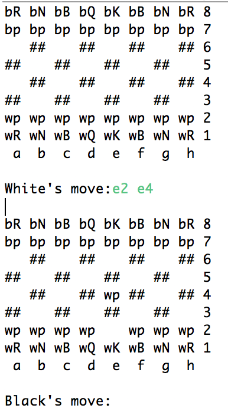

# README #

Download or clone the chess27 repository to play a game of chess! 

### What is this repository for? ###

Created by kyle Myers -kwm38- and Chris LoPresti -cpl62- for Rutgers cs213

### How do I get set up? ###

Once you have the directory cloned or downloaded to your computer. Compile the code or run it in and IDE.

### How do I play? ###

White always goes first.

When making a move there is a strict format. Filerank Filerank

Example: e2 e4 (will move a white pawn up two places at the start of the game)

Any other format will be deemed an illegal move. 

